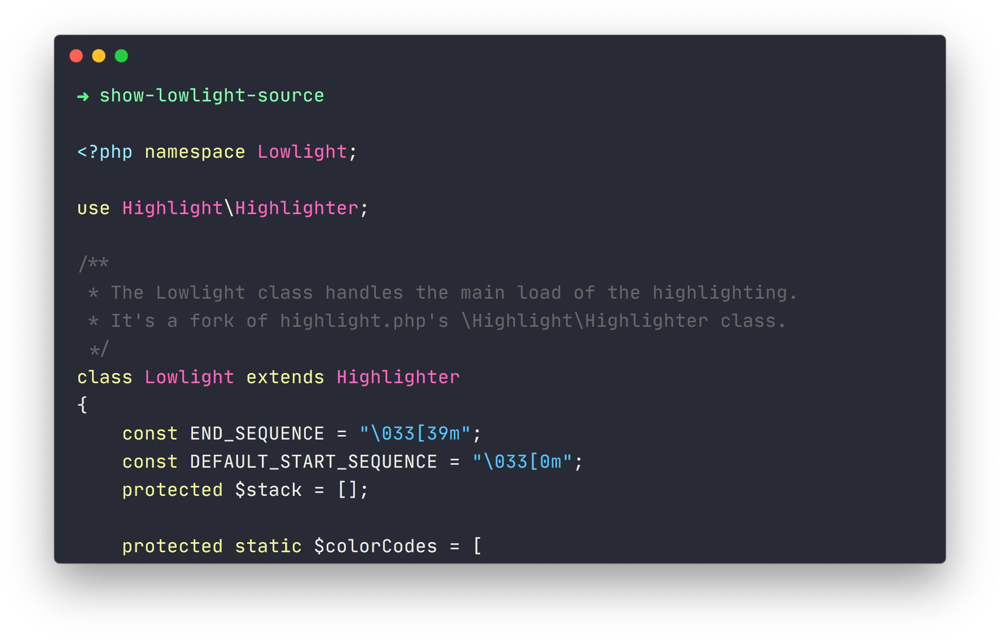

<div align="center">
  
</div>

# Lowlight
[](https://travis-ci.org/Loilo/Lowlight)
[](https://ci.appveyor.com/project/Loilo/Lowlight)
[](https://packagist.org/packages/loilo/Lowlight)

Lowlight shows syntax-highlighted code of 150+ languages in your terminal. It's built on top of [highlight.php](https://github.com/scrivo/highlight.php).



## Installation
This package is available via Composer. To add it to your project, just run:

```bash
composer require loilo/lowlight
```

## Usage
### Preconditions
If you're not running Lowlight in a framework context, you may need to initialize Composer's autoloading first:

```php
require_once __DIR__ . '/vendor/autoload.php';
```

### Getting Started
To highlight a piece of PHP code, do this:

```php
$ll = new Lowlight\Lowlight;

echo $ll->highlight('php', $somePhpSnippet)->value;
```

There are a lot of languages available. See the full list [here](https://github.com/scrivo/highlight.php/tree/master/Highlight/languages).

### Automatic Language Detection
If you're handling user-provided code, you may not always know the used language. That's where auto detection comes into play.

Let's say we got configuration code, but we aren't sure if it's JSON, YAML or INI, then the following approach would highlight it appropriately:

```php
$ll = new Lowlight\Lowlight;

echo $ll->highlightAuto($userProvidedCode, [ 'json', 'yaml', 'ini' ])->value;
```

The second argument to the `highlightAuto()` method are the languages the code will be checked against.
* Passing the parameter is optional. It defaults to `[ 'xml', 'json', 'javascript', 'css', 'php', 'http' ]`.
* You can adjust the default detection languages by calling
  ```php
  $ll->setDefaultAutodetectLanguages([ 'json', 'yaml', 'ini' ]);
  ```

### Theming
Theming works in analogy to highlight.js' theming. Highlight.js represents each token as CSS class name (e.g. `hljs-comment`) while Lowlight uses the tokens as keys in a theming array:

```php
$ll->theme['comment'] = 'green';
```

As you can see, styling is quite limited in the terminal. Lowlight only allows you to set a token's text color, nothing else. Therefore, you usually won't be able to create the same amount of atmosphere through a theme as you can do in CSS (except, maybe, when using arbitrary RGB colors).

#### Colors
Available colors are:
* `default` (the terminal's default text color)
* `black`
* `gray` / `grey` (actually the same)
* `white`, `bright-white`
* `red`, `bright-red`
* `green`, `bright-green`
* `yellow`, `bright-yellow`
* `blue`, `bright-blue`
* `magenta`, `bright-magenta`
* `cyan`, `bright-cyan`

#### RGB Colors
Many modern terminals do support a 24-bit color palette. Instead of using the 16ish oldschool color names, you can provide an RGB array for a token:

```php
$ll->theme['comment'] = [ 0, 175, 95 ];
```

If you want to use those, detecting support for 24-bit colors (as with all color-related features) is up to you.

#### Custom themes
To roll your own theme, it's a viable approach to take [an existing highlight.js theme](https://github.com/highlightjs/highlight.js/tree/master/src/styles), extract all `.hljs-xxx` classes and transform them to a PHP associative array.

> **Note:** You usually don't know the general style of the user's terminal and how your theme integrates with that (most notably if they're using a dark or a light theme), so be careful and restrictive with the colors you use.

By the way, this is Lowlight's default theme:
```php
$ll->theme = [
    'comment' => 'gray',
    'string' => 'blue',
    'number' => 'green',
    'literal' => 'bright-green',
    'meta' => 'cyan',
    'meta-string' => 'bright-cyan',

    'keyword' => 'yellow',
    'attribute' => 'yellow',
    'selector-tag' => 'yellow',
    'meta-keyword' => 'yellow',
    'doctag' => 'yellow',
    'name' => 'yellow',

    'type' => 'red',
    'subst' => 'red',
    'selector-id' => 'red',
    'selector-class' => 'red',
    'quote' => 'red',
    'template-tag' => 'red',
    'deletion' => 'red',

    'title' => 'magenta',
    'section' => 'magenta',
    'built_in' => 'magenta',

    'regexp' => 'bright-red',
    'symbol' => 'bright-red',
    'variable' => 'bright-red',
    'template-variable' => 'bright-red',
    'link' => 'bright-red',
    'selector-attr' => 'bright-red',
    'selector-pseudo' => 'bright-red',

    'built' => 'green',
    'bullet' => 'green',
    'code' => 'green',
    'addition' => 'green',

    'emphasis' => 'red',
    'strong' => 'red'
];
```

## Credit
* [highlight.php](https://github.com/scrivo/highlight.php) (a port of [highlight.js](https://github.com/highlightjs/highlight.js)) is a syntax highlighter with HTML output. It does most of Lowlight's heavy lifting. Check it out!
* Lowlight's logo is based on [a graphic](https://github.com/twitter/twemoji/blob/gh-pages/2/svg/1f6cb.svg) from the [Twemoji Project](https://github.com/twitter/twemoji) (licensed under [CC BY 4.0](https://creativecommons.org/licenses/by/4.0/)).
